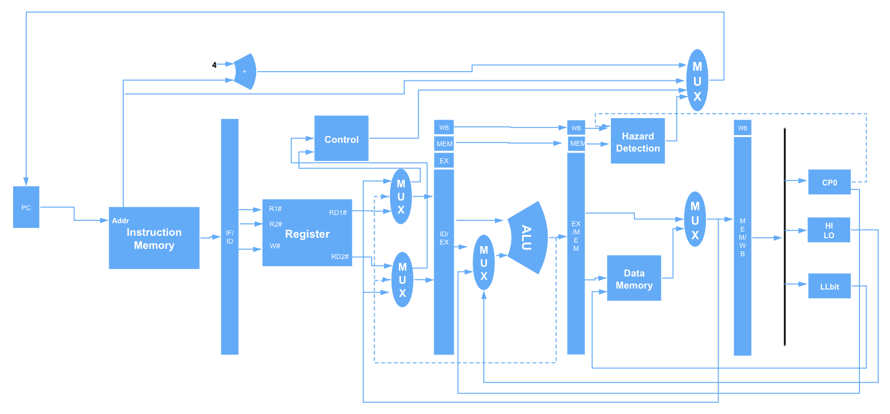
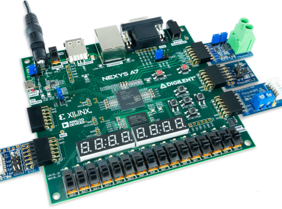

# Begin a MIPS32 process

计算机原理实验初探

初步的数据流图如下:

初步设计出为五级流水型CPU，使用的FPGA板子为Nexys4 DDR2

## 大致结构
### 取指阶段

- PC模块：给出指令地址，其中实现了指令指针寄存器PC，该寄存器的值局势指令地址
- IF/ID模块：实现取指与译码阶段之间的寄存器，将取指阶段的结果（取得的指令、指令地址等信息）在下一个时钟传递到译码阶段
### 译码阶段

- ID模块：对指令进行译码，译码结果包括运算类型、运算所需的源操作数、要写入的目的寄存器地址等
- Regfile模块：实现了32个32位通用寄存器，可以同时进行两个寄存器的读操作和一个寄存器的写操作
- ID/EX模块：实现译码与执行阶段之间的寄存器，将译码阶段的结果在下一个时间周期传递到执行阶段

### 执行阶段

- EX模块：依据译码阶段的结果，进行指定的运算，给出运算结果
- DIV模块：进行除法运算的模块
- EX/MEM模块：实现执行与访存阶段之间的寄存器，将执行阶段的结果在下一个时间周期传递到访存阶段

### 访存阶段

- MEM模块：如果是加载、存储指令，那么会对数据存储器进行访问。此外，还会在该模块进行异常判断
- MEM/WB模块：实现访存与回写阶段之间的寄存器，将访存阶段的结果在下一个时间周期传递到回写阶段

### 回写阶段
- CP0模块：对应MIPS架构中的协处理器CP0
- LLbit模块：实现寄存器LLbit，在链接加载指令ll、条件存储指令sc的处理过程中会使用到该寄存器
- HILO：实现寄存器HI、LO，在乘法、除法指令的处理过程中会使用到这两个寄存器

    
    > SDRAM:使用vivado自带的IP核进行配置，Nexy4s DDR2大小为128M
    
## TODO
- [x] SDRAM的配置
- [x] flash的配置
- [x] uart串口数据的同步(慢慢调orz)
- [x] 数据流图实现
- [x] vivado初步上板验证
- [ ] clk时钟的调试
- [ ] cash配置
- [ ] 数据旁路重新设计
- [ ] 上ucore

## Reference
1. 《See_MIPS_run_linux》
2. 《自己动手写CPU》

